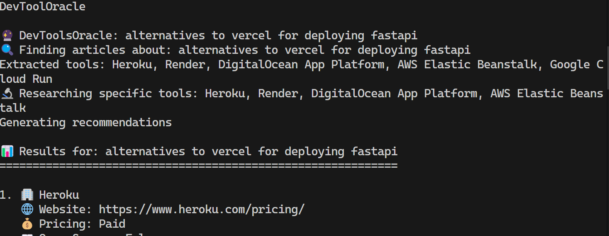

# 🔮 DevToolOracle

[](https://www.python.org/downloads/)
[](https://github.com/langchain-ai/langgraph)
[](https://openai.com/)
[](https://firecrawl.dev/)
[](https://opensource.org/licenses/MIT)


An intelligent developer assistant that helps you discover and compare developer tools based on your query. DevToolOracle combines OpenAI’s GPT-4o, Firecrawl web scraping, and LangGraph workflows to deliver structured, trustworthy tool suggestions — complete with pricing, APIs, tech stacks, and more.


## 🖼️ Snapshot



## 🔧 Prerequisites

- [Python 3.13](https://www.python.org/downloads/) or higher
- [uv](https://docs.astral.sh/uv/#highlights) (for managing python dependencies and setting up a virtual environment)
- [Node.js](https://nodejs.org/en) (for Firecrawl MCP)
- [OpenAI API](https://platform.openai.com) key
- [Firecrawl](https://www.firecrawl.dev/) API key

## 📥 Installation

1. Clone the project

```
git clone https://github.com/smaranjitghose/devtooloracle
```

2. Navigate inside the directory

```
cd devtooloracle
```
3. Create a `.env` file and store the API keys from OPENAI and FIRECRAWL as:

```
OPENAI_API_KEY=your-openai-api-key-here
FIRECRAWL_API_KEY=your-firecrawl-api-key-here
```

4. Run the agent using uv (one the first run it will create a virtual environment and install the dependencies in it)

```
uv run main.py
```

5. Start chatting with examples:

```
🔮 DevToolOracle: best postgres hosting tools

```

6. Exit when done:

```
🔮 DevToolOracle: bye
```


## 💡 Usage Examples

### Tool Discovery
```
🔮 DevToolOracle: best open-source analytics tools
```

### DeveloperAI
```
🔮 DevToolOracle: authentication API platforms for startups
```


## 🔍 How It Works

1. LangGraph Workflow
    - extract_tools → Finds relevant tools from web articles
    - research → Scrapes tool sites and analyzes content
    - analyze → Summarizes recommendations using GPT-4o

2. Firecrawl Integration
    - Web scraping for structured Markdown content
    - Query and content aware extraction

3. Structured LLM Output
    - Tools are parsed into CompanyInfo models with attributes like:
        - Pricing
        - Tech stack
        - Language support
        - API availability

5. Final Summary
    - gpt-4o-mini generates concise recommendations based on structured analysi

## 🛡️ Best Practices

### Ethical Scraping
- Always respect `robots.txt` files
- Be mindful of rate limiting and server load
- Only scrape publicly available content
- Consider reaching out to site owners for large-scale scraping

### API Usage
- Monitor your Firecrawl and OpenAI API usage
- Set appropriate rate limits in production
- Cache results when appropriate to reduce API calls

## 🔧 Troubleshooting

### Common Issues


**"Invalid API key" errors**
- Verify your `.env` file is in the correct location
- Check that API keys are valid and have sufficient credits
- Ensure no extra spaces or quotes in the `.env` file

**Connection timeout errors**
- Check your internet connection
- Some websites may block automated requests
- Try with a different website to test functionality

**Python import errors**
```bash
uv add --upgrade mcp langchain-mcp-adapters langgraph langchain-openai python-dotenv
```

## 🤝 Contributing

Contributions are welcome! Here's how:

1. Fork the repository
2. Create a feature branch
```
git switch -c feature/amazing-feature
```
3. Commit and push your changes
```
git commit -m "Add amazing feature"
git push origin feature/amazing-feature
```
4. Open a pull request


## 📝 License

This project is licensed under the MIT License - see the [LICENSE](LICENSE) file for details.

---

Made with ❤️ by [Smaranjit Ghose](https://github.com/smaranjitghose)
